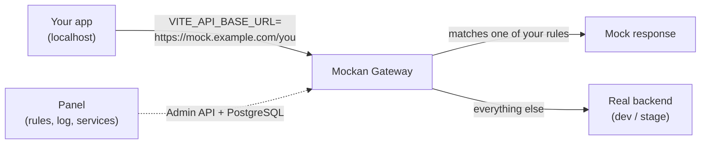

<h1 align="center">Mockan<span>.</span></h1>

<p align="center">
  <strong>Mock only the endpoints that don't exist yet. Everything else goes to the real backend.</strong><br>
  A personal mock gateway for frontend developers: no mock code in your app, just a base URL.
</p>

<p align="center">
  
  
  
  
</p>

<p align="center">
  
</p>

## Why Mockan

You are building a new screen, but the endpoint behind it isn't deployed yet. A classic mock server replaces the *whole* API, so you lose login, tokens and every page that already works. The usual workarounds are environment-variable juggling or `if (mock)` branches in your code, and both leave throw-away code that has to be removed before you push.

Mockan sits between your app and the real backend:



- Requests that match one of your **rules** get your mock response.
- Every other request is **proxied unchanged** to the real service, so login, token refresh and existing pages keep working.
- Your frontend diff contains **no mock code**. When the real endpoint ships, disable the rule and nothing else changes.

## Features

**Mocking**
- **Isolated workspaces.** Everyone gets their own address (`/{slug}/...`); your rules never affect a teammate and theirs never affect you.
- **Flexible matching.** `Exact`, `Template` (`/orders/{id}`), `Prefix` and `Regex` (linear-time RE2, so no catastrophic patterns), plus optional method, query and header conditions. A deterministic precedence decides which rule wins.
- **Static or templated responses.** Set status, headers, content type, body and an artificial delay. Templated bodies (Jinja2 sandbox) can use the request, route parameters and a whitelist of [Faker](https://faker.readthedocs.io/) generators.
- **Scenarios.** Keep several named responses per rule (`success`, `empty`, `error-500`) and switch between them in one click.
- **Live in about 2 seconds.** Changes reach every Gateway replica without a restart.
- **Enable or disable** a single rule, or all of them, to compare against the real endpoint.

**Proxy that behaves**
- **Transparent reverse proxy.** Method, path, query, headers and body are preserved. Streaming, large uploads and downloads, SSE and WebSockets work without full buffering.
- **Browser-ready.** Preflight requests are answered, CORS headers are normalized, `Location` headers and cookies are rewritten for the gateway URL.
- **Multi-service routing.** A catalog of services, each with a path prefix and `dev` / `stage` base URLs. Pick the environment per service.
- **Always labeled.** Every response carries `X-Mockan-Source: mock | proxy | error`, so you never mistake fake data for real data.

**Productivity**
- **Live request log** with a **Mock this** button that turns a real, logged response into a rule.
- **Test route:** ask what *would* happen to a request (which rule, which upstream) without sending it.
- **Export / import** rules as JSON to share a mock set or keep it beside a branch.

**Operations**
- Stateless Gateway replicas, health and readiness endpoints, plus OpenTelemetry metrics and opt-in tracing exported over OTLP.
- Upstream **host allowlist** (Mockan is never an open proxy), secrets masked in logs, OIDC sign-in (for example Keycloak).

<p align="center">
  
</p>

<p align="center">
  
</p>

## Quick start

You need [Docker](https://docs.docker.com/get-docker/) with Compose.

```bash
git clone https://github.com/modarreszadeh/Mockan.git
cd Mockan/deploy/compose
docker compose --profile demo up --build
```

| What | Where |
| --- | --- |
| Panel and Admin API | <http://localhost:8765> (Admin API under `/api`) |
| Gateway (both replicas, via nginx) | <http://localhost:8765/mock> |
| PostgreSQL | `localhost:5432` (user, password and database `mockan`) |

Set `MOCKAN_DB_PORT=5433` if port 5432 is taken, or `MOCKAN_PORT` to change the 8765 entry point. The public base URL is `MOCKAN_PUBLIC_BASE_URL` in `deploy/compose/.env` (copy `.env.example`); the Panel and the Gateway both read it. The `demo` profile adds a tiny fake backend (`fake-upstream:9000`) to proxy to.

Then try the whole journey from the command line:

```bash
A=http://localhost:8765; H='content-type: application/json'
curl -c jar -s "$A/api/v1/auth/login" -o /dev/null                          # sign in (dev mode)
curl -b jar -X PUT  -H "$H" -d '{"slug":"ehtesham"}' $A/api/v1/me             # claim your address
curl -b jar -X POST -H "$H" -d '{"name":"limsa","pathPrefix":"/limsa"}' $A/api/v1/services   # note the id
curl -b jar -X POST -H "$H" -d '{"environment":"stage","baseUrl":"http://fake-upstream:9000"}' \
     $A/api/v1/services/<id>/environments

curl -i http://localhost:8765/mock/ehtesham/limsa/api/v1/dashboard                # X-Mockan-Source: proxy
```

Now open the Panel, create a rule for `GET /limsa/api/v1/dashboard`, and repeat the last request: within about 2 seconds it returns your mock with `X-Mockan-Source: mock`. Point your app at it:

```bash
# .env
VITE_API_BASE_URL=http://localhost:8765/mock/ehtesham
```

> [!WARNING]
> The compose stack runs with `MOCKAN_AUTH_MODE=dev`: anyone who can reach the Admin can sign in as anyone. It is for local use only. Never run dev mode on a shared network; configure OIDC instead (see [operations](docs/backend/operations.md)). Mockan is a development tool and is not meant to serve production traffic or to be exposed to the internet.

## Deploy to a server

CI (`.github/workflows/ci.yml`) tests every change and, from `main`, publishes the Admin and Gateway images to GitHub Container Registry as `ghcr.io/modarreszadeh/mockan/admin` and `/gateway`, tagged `latest`, `main` and the commit SHA. The images are `linux/amd64`. A server only needs Docker (Compose 2.24 or newer) and a checkout of this repository:

```bash
git clone https://github.com/modarreszadeh/Mockan.git && cd Mockan/deploy/compose
./deploy.sh --dry-run      # validate .env and show the plan; changes nothing
./deploy.sh                # deploy the latest images
```

On the first run `deploy.sh` creates `.env` from [`.env.production.example`](deploy/compose/.env.production.example), generates the database password and session secret (never printed), and stops with the list of values only you can supply: the Keycloak issuer, client id and secret, and the admin `sub` values. Fill them in `.env` and run it again. `MOCKAN_PUBLIC_BASE_URL` (default `https://mockan.novin-tools.com/mock`) is the one place the public base URL is set. The Panel and the Gateway both read it.

| Command | What it does |
| --- | --- |
| `./deploy.sh <sha>` | Deploy a specific image tag. |
| `./deploy.sh --rollback` | Go back to the previous tag. Images only: migrations are not reverted. |
| `./deploy.sh --check-db` | Show the database revision. |
| `./deploy.sh --no-pull` | Use the images already on the machine. |

By default it runs its own PostgreSQL container. To use a shared PostgreSQL that is reachable on a Docker network instead, set `MOCKAN_DB_MODE=external`, `MOCKAN_DB_NETWORK` and `MOCKAN_DATABASE_URL` in `.env` (create a role and database for Mockan there first). If Docker Hub is blocked on the server, set `MOCKAN_NGINX_IMAGE` to an nginx image it already has; nginx and PostgreSQL images are only pulled when missing.

Production runs OIDC sign-in (never dev mode) and publishes one port, nginx on `MOCKAN_BIND:MOCKAN_PORT` (default `127.0.0.1:8765`). Put your TLS reverse proxy in front of it and forward `https://<domain>/` to that port. Register `https://<domain>/api/v1/auth/callback` as the redirect URI in Keycloak. See [operations](docs/backend/operations.md) for the details.

## How it works

Mockan is two processes that share a PostgreSQL database:

| Part | Role | Stack |
| --- | --- | --- |
| **Gateway** (`mockan.gateway`) | Data plane. Resolves the developer and service from the path, matches rules against an in-memory snapshot, answers with a mock or streams the request upstream. Stateless; scale by adding replicas. | FastAPI, Uvicorn, `httpx`, `websockets`, RE2 |
| **Admin** (`mockan.admin`) | Control plane. Admin API, sign-in, migrations, live-log WebSocket, and it serves the Panel. | FastAPI, SQLAlchemy 2 (async), Alembic |
| **Panel** (`panel/`) | The web UI where you claim a slug and manage rules, services, the log and settings. | React 19, TypeScript, Vite, Tailwind CSS v4, shadcn/ui, TanStack Query |

Rule changes are written to PostgreSQL and announced with `LISTEN/NOTIFY`; each Gateway rebuilds its snapshot, with a periodic reload as a safety net.

## Repository layout

```
server/        Python backend: Gateway + Admin (one uv project, one `mockan` package)
panel/         React single-page app, built into the Admin image
deploy/        Docker images, the local Compose stack and the production deploy.sh
.github/       CI workflow (tests, image build and publish to GHCR)
docs/          All documentation (see docs/README.md)
  product/       Product requirements, personas, user journey
  backend/       Backend design, conventions and operations
  frontend/      Panel design tokens, components, screens and conventions
  agent/         System architecture and the rules coding agents follow
CONTEXT.md     Project glossary
```

## Development

**Backend** (Python 3.14 and [uv](https://docs.astral.sh/uv/)):

```bash
cd server
uv sync
docker compose -f ../deploy/compose/docker-compose.yml up -d postgres
uv run alembic upgrade head
uv run uvicorn mockan.admin.app:create_app --factory --port 8081 --reload
uv run uvicorn mockan.gateway.app:create_app --factory --port 8080 --reload
./scripts/check.sh      # lint + format + mypy + import contracts + tests
```

**Panel** (Node.js and npm):

```bash
cd panel
npm ci
npm run dev             # http://localhost:5173 with a mock backend (MSW); /__design is the style guide
npm run check           # typecheck + lint + tests + build
npm run e2e             # Playwright end-to-end journey
```

To develop the Panel against a real Admin, run the Admin on port 8081 and start the Panel with `VITE_USE_MSW=false npm run dev`.

Database tests use Testcontainers and need Docker; `uv run pytest -m "not db"` skips them.

## Documentation

All project documentation is Markdown, written to be read by people and by AI coding agents alike.

| Start here | |
| --- | --- |
| [Product requirements](docs/product/mockan-prd.md) | What Mockan does, for whom and why. |
| [Architecture](docs/agent/mockan-architecture.md) | The system design: request lifecycle, matching, data model, Admin API. |
| [Backend docs](docs/backend/README.md) | Stack, structure, Gateway, Admin API, database, operations, testing. |
| [Frontend docs](docs/frontend/README.md) | Design tokens, components, screens, conventions, testing. |
| [Glossary](CONTEXT.md) | MockRule, Scenario, Request log and the other terms used throughout. |

## Status

Phase 1 (workspaces, proxy, matching, static mocks, Panel) and Phase 2 (scenarios, live log, test route, export/import, templated bodies, operability) are built. Phase 3 (contract-driven features) is not planned yet.

## Contributing

Issues and pull requests are welcome. Please:

- Read the [glossary](CONTEXT.md) and use its terms in code and docs.
- Run `./scripts/check.sh` (backend) and `npm run check` (Panel) before you push.
- Update the matching Markdown document in the same pull request as any change to behavior, schema, API or structure.
